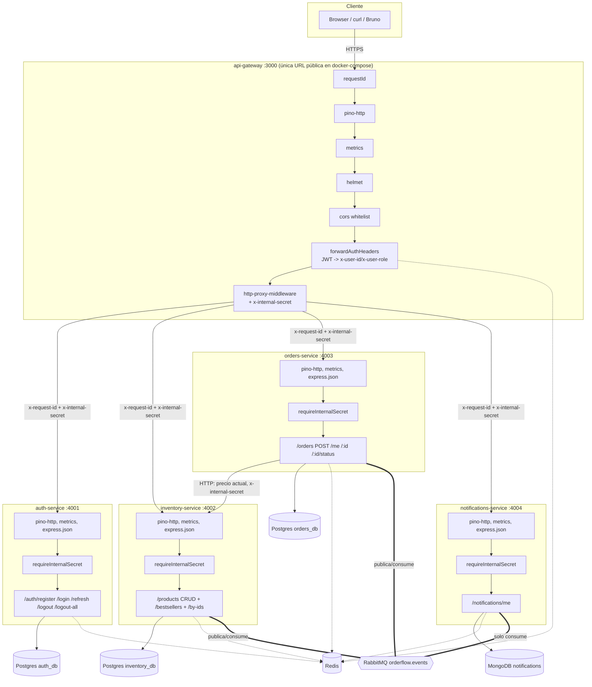
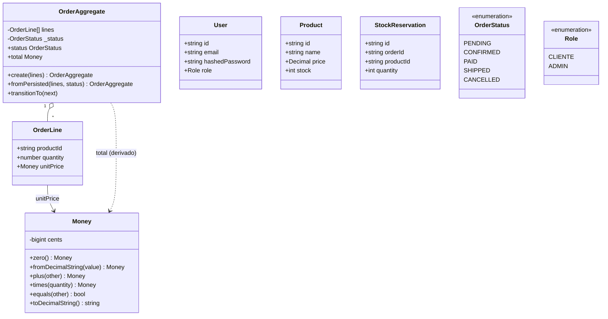
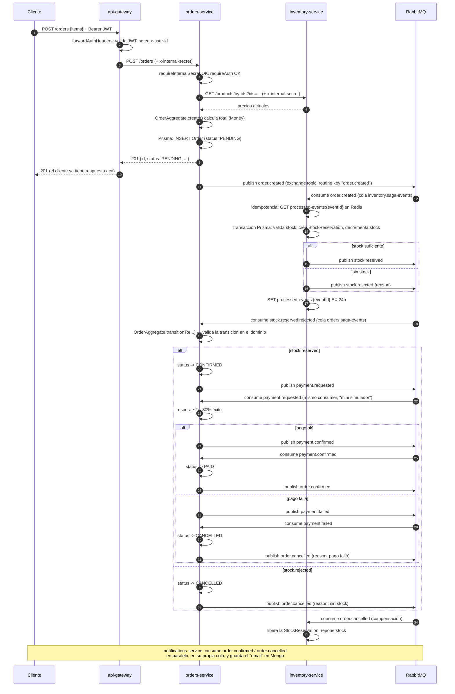

# Arquitectura técnica de OrderFlow

Este documento complementa al [`README.md`](./README.md) (que es la vidriera del portfolio) con
el detalle técnico completo: cada endpoint con su contrato, el pipeline de middleware de cada
servicio, el modelo de dominio, los contratos de eventos, y cómo interactúan las tecnologías
entre sí. Pensado para alguien que va a revisar el código en serio, no para una primera lectura.

## Índice

1. [Diagrama de componentes](#diagrama-de-componentes)
2. [Pipeline de middleware por servicio](#pipeline-de-middleware-por-servicio)
3. [Modelo de dominio](#modelo-de-dominio)
4. [Referencia completa de la API](#referencia-completa-de-la-api)
5. [Flujo de una orden de punta a punta](#flujo-de-una-orden-de-punta-a-punta)
6. [Contratos de eventos (RabbitMQ)](#contratos-de-eventos-rabbitmq)
7. [Cómo interactúan las tecnologías](#cómo-interactúan-las-tecnologías)

---

## Diagrama de componentes

`requireInternalSecret` y `x-internal-secret` no existen en el diagrama de la saga del README
por simplicidad — viven en el pipeline HTTP de cada servicio, no en la lógica de negocio. Ver
[`packages/shared/src/security/internalAuth.ts`](./packages/shared/src/security/internalAuth.ts).

---

## Pipeline de middleware por servicio

El orden importa: cada middleware asume que el anterior ya corrió.

### api-gateway

| # | Middleware | Qué hace | Archivo |
|---|-----------|----------|---------|
| 1 | `requestId` | Genera (o respeta) `x-request-id`, lo pone en la respuesta. Viaja a todos los servicios internos vía el proxy. | `middleware/requestId.ts` |
| 2 | `pino-http` | Logging estructurado; usa el `x-request-id` como `reqId` (`genReqId`). | `app.ts` |
| 3 | `metricsMiddleware` | Contador + histograma de latencia por ruta para `/metrics` (Prometheus). | `@orderflow/shared` |
| 4 | `helmet` | Headers de seguridad (CSP, HSTS, X-Frame-Options, etc.). | `app.ts` |
| 5 | `cors` | Whitelist explícita vía `CORS_ORIGINS` — vacío por defecto (sin frontend todavía). | `app.ts` |
| 6 | `forwardAuthHeaders` | Borra `x-user-id`/`x-user-role` siempre primero, después los repone si hay un JWT válido en `Authorization`. | `middleware/forwardAuthHeaders.ts` |
| 7 (solo `/auth/login`) | `loginRateLimiter` | 5 intentos / 15 min por IP, usando `INCR`+`EXPIRE` en Redis. Si Redis está caído, deja pasar (degradado, no bloquea). | `middleware/loginRateLimiter.ts` |
| 8 | `http-proxy-middleware` | Reenvía al servicio interno correspondiente, agregando `x-internal-secret` en `onProxyReq`. | `proxies.ts` |

### Los 4 servicios internos (mismo esqueleto en los 4)

| # | Middleware | Qué hace |
|---|-----------|----------|
| 1 | `pino-http` | Logging, mismo `x-request-id` como `reqId`. |
| 2 | `metricsMiddleware` | Métricas Prometheus del servicio. |
| 3 | `express.json()` | Body parsing (no aplica en api-gateway, que reenvía el stream crudo). |
| — | `/health`, `/metrics` | Registradas ANTES del chequeo de secret — Render y Prometheus les pegan directo, sin pasar por el gateway. |
| 4 | `requireInternalSecret` | Rechaza con 403 cualquier request al resto de las rutas sin `x-internal-secret` correcto. |
| 5 | Router del módulo (`/auth`, `/products`, `/orders`, `/notifications`) | Incluye `requireAuth` (lee `x-user-id`/`x-user-role`, NO revalida firma) y `requireRole("ADMIN")` donde aplica, más `validateBody`/`validateQuery`/`validateParams` (Zod) antes del controller. |
| 6 | `errorHandler` | Último middleware: `AppError` → `{status, message}` tal cual; cualquier otra excepción → 500 genérico + log. |

`auth-service` es la única excepción: en `/auth/logout-all` usa su **propio** `requireAuth`
(valida el JWT de nuevo, con `verifyAccessToken`), porque es el dueño de esa lógica de seguridad
— no tiene sentido que dependa de que el gateway ya lo haya validado.

---

## Modelo de dominio

**`Money`** es un Value Object inmutable: guarda centavos como `bigint` (no `number`, para no
repetir `0.1 + 0.2 !== 0.3`), se valida a sí mismo (no puede ser negativo), e igualdad por valor.

**`OrderAggregate`** es el aggregate root de la orden: las transiciones de estado están
encapsuladas ahí (`ALLOWED_TRANSITIONS`), no en un `if`/`switch` suelto en el service. Un intento
de transición inválida (ej. `SHIPPED → PENDING`) tira una excepción en el dominio, antes de
tocar la base. `PENDING → CONFIRMED → PAID → SHIPPED`, con `CANCELLED` alcanzable desde
`PENDING`/`CONFIRMED`/`PAID` pero no desde `SHIPPED`.

`User`, `Product` y `StockReservation` son entities simples (Prisma models) — no tienen lógica de
dominio no trivial, así que no se modelaron como agregados aparte.

---

## Referencia completa de la API

Todas las rutas se acceden **a través del gateway** (`https://<gateway>/...`). Auth: `—` público,
`autenticado` (`Authorization: Bearer <accessToken>`), `ADMIN` (autenticado + `role: ADMIN`).

### auth-service — `/auth`

| Método | Ruta | Auth | Body | Respuesta | Errores |
|--------|------|------|------|-----------|---------|
| POST | `/register` | — | `{email, password (min 8)}` | `201 {accessToken, refreshToken}` | `409` email ya existe · `400` validación |
| POST | `/login` | — (rate limit 5/15min/IP) | `{email, password}` | `200 {accessToken, refreshToken}` | `401` credenciales inválidas · `429` rate limit |
| POST | `/refresh` | — | `{refreshToken}` | `200 {accessToken, refreshToken}` (rota el token) | `401` inválido/expirado/revocado (reuse detection) |
| POST | `/logout` | — | `{refreshToken}` | `204` | — (silencioso si el token ya no es válido) |
| POST | `/logout-all` | autenticado | — | `204` | `401` |

`accessToken`: JWT HS256, payload `{userId, role}`, expira en **15 min**.
`refreshToken`: JWT HS256, payload `{userId, tokenId}`, expira en **7 días**; el estado real
(`active`/`revoked`/`missing`) vive en Redis, no en el JWT — ver sección de Redis más abajo.

### inventory-service — `/products`

| Método | Ruta | Auth | Body/Query | Respuesta | Errores |
|--------|------|------|-----------|-----------|---------|
| GET | `/` | — | `?page&limit(max 100)&name` | `200 {items[], pagination}` — header `X-Cache: HIT\|MISS` | `400` validación |
| GET | `/bestsellers` | — | `?limit` | `200 [{...product, sold}]` (Redis sorted set) | — |
| GET | `/by-ids` | — (uso interno, orders-service) | `?ids=uuid,uuid` | `200 Product[]` | — |
| POST | `/` | ADMIN | `{name, price>0, stock>=0}` | `201 Product` | `403` no-admin · `400` validación |
| PATCH | `/:id` | ADMIN | Cualquier subconjunto de `{name, price, stock}` (sin defaults) | `200 Product` | `404` · `403` · `400` |
| DELETE | `/:id` | ADMIN | — | `204` | `404` · `403` |

Cualquier `POST`/`PATCH`/`DELETE` invalida TODAS las claves `products:list:*` en Redis (no
invalidación selectiva — el volumen de productos de una demo no lo justifica).

### orders-service — `/orders`

| Método | Ruta | Auth | Body | Respuesta | Errores |
|--------|------|------|------|-----------|---------|
| POST | `/` | autenticado | `{items: [{productId, quantity>0}], min 1 item}` | `201 Order` (status `PENDING`) — dispara la saga | `503` si inventory-service no responde (precio) · `400` |
| GET | `/me` | autenticado | — | `200 Order[]` del usuario logueado | `401` |
| GET | `/:id` | autenticado | — | `200 Order` | `403` si no es tuya y no sos ADMIN · `404` |
| PATCH | `/:id/status` | ADMIN | `{status: PENDING\|CONFIRMED\|PAID\|SHIPPED\|CANCELLED}` | `200 Order` | `400` transición inválida (la valida `OrderAggregate`) |

`POST /orders` es síncrono hasta devolver `201 PENDING` (necesita el precio actual de
inventory-service para calcular `total`); todo lo que pasa después (reserva de stock, pago,
confirmación) es asíncrono vía eventos — el cliente hace polling a `GET /orders/:id`.

### notifications-service — `/notifications`

| Método | Ruta | Auth | Respuesta |
|--------|------|------|-----------|
| GET | `/me` | autenticado | `200 Notification[]` (Mongo) — historial de "emails" simulados generados por la saga |

### Gateway — rutas propias (no proxied)

| Método | Ruta | Qué hace |
|--------|------|----------|
| GET | `/health` | Pega `GET /health` a los 4 servicios en paralelo, agrega el resultado. `200` si todos ok, `503` si alguno falla. |
| GET | `/metrics` | Métricas Prometheus del propio gateway (no agrega las de los demás — cada servicio expone las suyas). |

### Formato de error uniforme

Todos los servicios devuelven errores como `{"error": "mensaje"}` con el status code de la
`AppError` correspondiente (`BadRequestError` 400, `UnauthorizedError` 401, `ForbiddenError` 403,
`NotFoundError` 404, `ConflictError` 409) — cualquier excepción no controlada cae en `500`
genérico (el mensaje real solo se loguea, nunca se expone al cliente).

---

## Flujo de una orden de punta a punta

Cada consumer valida idempotencia (`processed-events:{eventId}` en Redis, TTL 24h) ANTES de
procesar y la marca DESPUÉS de procesar con éxito — si se marcara antes, un mensaje que falla a
mitad de camino se vería a sí mismo como "ya procesado" en el retry y nunca llegaría a la DLQ (bug
real encontrado y corregido durante el desarrollo).

---

## Contratos de eventos (RabbitMQ)

Exchange único `orderflow.events`, tipo `topic`, durable. Cada servicio consumidor tiene su
propia cola (`<servicio>.saga-events`) con su propia DLQ (`<servicio>.saga-events.dlq`) — no
comparten cola, cada uno bindea las routing keys que le interesan.

| Routing key | Publica | Consume | Payload |
|-------------|---------|---------|---------|
| `order.created` | orders-service | inventory-service | `{eventId, orderId, userId, items[], total, occurredAt}` |
| `stock.reserved` | inventory-service | orders-service | `{eventId, orderId, occurredAt}` |
| `stock.rejected` | inventory-service | orders-service | `{eventId, orderId, reason, occurredAt}` |
| `payment.requested` | orders-service | orders-service (mismo consumer) | `{eventId, orderId, userId, total, occurredAt}` |
| `payment.confirmed` | orders-service | orders-service | `{eventId, orderId, occurredAt}` |
| `payment.failed` | orders-service | orders-service | `{eventId, orderId, reason, occurredAt}` |
| `order.confirmed` | orders-service | notifications-service | `{eventId, orderId, userId, occurredAt}` |
| `order.cancelled` | orders-service | inventory-service (compensación) + notifications-service | `{eventId, orderId, userId, reason, occurredAt}` |

**Retry y DLQ** (igual en los 3 consumers, `MAX_RETRIES = 3`): si el handler tira una excepción
normal, el mensaje se re-publica al mismo exchange con `x-retry-count` incrementado y un backoff
de `500ms * (retryCount + 1)`, después de agotar los 3 reintentos va a la DLQ. Si el handler tira
una `NonRetryableError` (ej. una transición de estado inválida — reintentar no la va a arreglar),
va directo a la DLQ sin gastar reintentos. En los dos casos el mensaje original se **ack**ea
igual (no se deja en la cola principal) — el reintento es un mensaje nuevo, explícito.

---

## Cómo interactúan las tecnologías

### Express + Zod — validación como middleware, no como `if` en el controller

Cada input (`body`/`query`/`params`) se valida con un schema Zod ANTES de llegar al controller
(`validateBody`/`validateQuery`/`validateParams`). Si falla, corta con `400` antes de tocar
lógica de negocio. Detalle: Express 5 hizo `req.query` de solo lectura (getter sin setter), así
que el resultado validado de `query` se guarda en `req.validatedQuery` en vez de reasignar
`req.query`.

### Prisma + PostgreSQL — una base por servicio, cero JOINs cross-servicio

`auth-service`, `inventory-service` y `orders-service` tienen cada uno su propio schema Prisma y
su propia base física (`auth_db`/`inventory_db`/`orders_db`, hoy en el mismo cluster de Neon,
podrían estar en clusters separados sin cambiar nada de código). Las migraciones (`prisma migrate
deploy`) corren en el `CMD` del contenedor, antes de levantar el server — si la migración falla,
el contenedor no arranca (falla rápido, no en un estado a medio migrar).

### Redis — 5 usos distintos, todos "best-effort" (degradan, no tumban el servicio)

1. **Cache-aside de productos** (`inventory-service`): `GET /products` cachea 60s por combinación
   de `page`/`limit`/`name`; cualquier mutación invalida TODO el prefijo `products:list:*`.
2. **Rate limiting de login** (`api-gateway`): `INCR` + `EXPIRE` con ventana de 15 min, 5
   intentos. Si Redis falla, el rate limiter **deja pasar** (logea warning) — se prioriza
   disponibilidad del login sobre el rate limit en un incidente de infra.
3. **Rotación de refresh tokens** (`auth-service`): el estado real (`active`/`revoked`) vive en
   Redis, no en el JWT. Al rotar, el token viejo pasa a `revoked` con `SET ... KEEPTTL` (conserva
   el TTL original en vez de resetearlo) — si alguien reusa un refresh token ya rotado (señal de
   robo), TODOS sus refresh tokens se invalidan (`deleteAllForUser`).
4. **Idempotencia de eventos** (los 3 consumers): `processed-events:{eventId}`, TTL 24h.
5. **Ranking de más vendidos** (`inventory-service`): `ZINCRBY` en un sorted set por cada venta
   confirmada, `ZREVRANGE` para el top N — evita un `GROUP BY` + `ORDER BY COUNT` contra Postgres
   en cada request.

### RabbitMQ — saga por coreografía, no orquestación

Ver [Contratos de eventos](#contratos-de-eventos-rabbitmq) arriba. La decisión de coreografía (en
vez de un orquestador central) significa que el flujo completo no vive en un solo lugar del
código — vive distribuido entre `inventory-service` e `orders-service`, cada uno reaccionando a
lo que le llega. El `x-request-id` que viaja como parte del payload del evento (no como header
AMQP) es lo que permite reconstruir el flujo completo grepeando logs de los 3 servicios.

### MongoDB — el único dato realmente schemaless del sistema

`notifications-service` es el único que usa Mongo (driver oficial, sin ODM). Elegido a propósito
para tener un caso real de "NoSQL de verdad" en el proyecto: las notificaciones no tienen un
esquema relacional natural (¿un mensaje de texto con metadata variable, por tipo de evento?), y
no hay JOINs ni transacciones multi-documento que las bases relacionales resolverían mejor.

### JWT — stateless para la firma, con estado en Redis para poder revocar

Un JWT firmado no se puede "invalidar" antes de que expire (es la naturaleza de un token
stateless). Por eso el `accessToken` vive solo 15 min (ventana de exposición corta) y el
`refreshToken`, que sí necesita poder revocarse (logout, robo detectado), delega su estado real a
Redis en vez de confiar ciegamente en la firma.

### Pino + `x-request-id` — correlación de logs sin tracing distribuido

Cada servicio loguea en JSON estructurado; el `x-request-id` (generado en el gateway si no viene,
o propagado si ya viene de otro servicio) se usa como `reqId` en `pino-http` (`genReqId`). No es
tracing distribuido real (no hay spans, no hay Jaeger/Zipkin) — es lo mínimo viable para poder
`grep` una request específica a través de 4 procesos distintos.

### Prometheus — métricas por servicio, sin agregación central en este repo

`createMetrics(serviceName)` (en `packages/shared`) expone `/metrics` en cada uno de los 5
servicios con un contador y un histograma de latencia por ruta+método+status. En local,
`docker-compose.yml` levanta Prometheus scrapeando los 5 targets y Grafana como datasource — en
el deploy de Render no están incluidos (fuera del alcance de esta ronda, ver "Qué mejoraría" en
el README).
