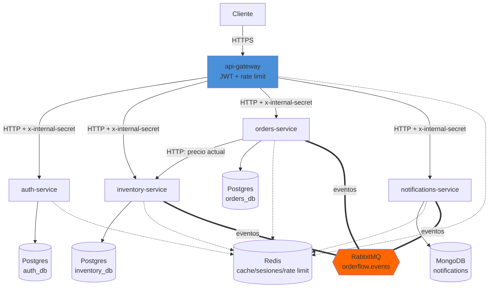
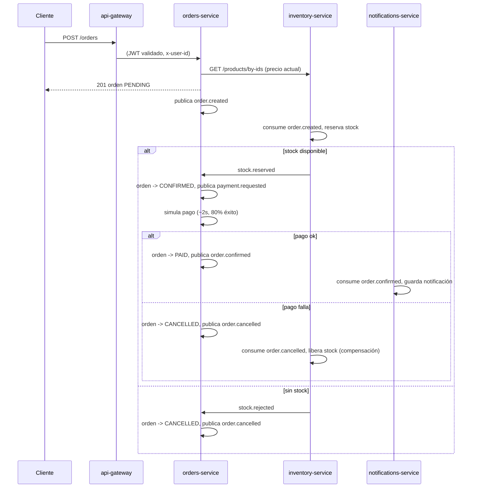

# OrderFlow

[](https://github.com/albertt-13/orderflow/actions/workflows/ci.yml)


Sistema de gestión de pedidos estilo e-commerce, construido como proyecto de aprendizaje para
un rol Sr Backend. Arrancó como monolito por capas (Fases 1-3) y se partió en microservicios
orientados a eventos (Fase 4) — el historial de commits muestra la evolución completa.

📐 **[ARCHITECTURE.md](./ARCHITECTURE.md)** — referencia técnica completa: cada endpoint con su
contrato, el pipeline de middleware de cada servicio, diagrama de clases del dominio, contratos
de eventos de RabbitMQ, y cómo interactúan Redis/Postgres/Mongo/JWT entre sí.

## Demo en vivo

Gateway público: **https://orderflow-api-gateway-my23.onrender.com**

```bash
curl https://orderflow-api-gateway-my23.onrender.com/health
```

Deployado en Render (5 Web Services, uno por Dockerfile) + Postgres en Neon + Redis en Upstash +
MongoDB en Atlas + RabbitMQ en CloudAMQP — combinación elegida específicamente por no requerir
tarjeta internacional. Un keep-alive externo (cron-job.org, cada 10 min contra `/health`)
mantiene los 5 servicios despiertos, así que no debería haber cold starts en horario normal.

## Estado actual

Fase 6 — Deploy completo: 5 servicios independientes, saga por coreografía de punta a punta,
cada uno con su propia base de datos, deployados en producción real. Ver el roadmap completo en
el vault de Obsidian del proyecto.

## Arquitectura

| Servicio | Bounded context | Base de datos | Se comunica por |
|----------|-----------------|---------------|------------------|
| **api-gateway** | Routing, validación de JWT, rate limit | — (Redis para rate limit) | HTTP hacia los demás |
| **auth-service** | Usuarios, tokens, roles | PostgreSQL propia (`auth_db`) | HTTP |
| **inventory-service** | Catálogo y stock | PostgreSQL propia (`inventory_db`) | HTTP + eventos |
| **orders-service** | Órdenes y la saga | PostgreSQL propia (`orders_db`) | HTTP (a inventory) + eventos |
| **notifications-service** | Notificaciones | MongoDB (`notifications`) | Solo eventos |

Ningún servicio lee la base de datos de otro. Si necesita datos de otro dominio, o llama por
HTTP (síncrono) o escucha eventos (asíncrono) — nunca un JOIN cruzando bases.

### Diagrama de arquitectura



Solo `api-gateway` tiene URL pública. Los otros 4 no deberían ser alcanzables desde afuera — en
`docker-compose` eso lo garantiza la red de Docker; en un free tier como Render, donde todo Web
Service queda público sí o sí, lo garantiza el `x-internal-secret` (ver mini-ADR más abajo).

### Saga por coreografía



El cliente ve la orden en `PENDING` apenas la crea y consulta `GET /orders/:id` (polling) para
ver cómo avanza — consistencia eventual, no inmediata.

### Decisiones de arquitectura (mini-ADRs)

**¿Por qué el gateway valida el JWT y no cada servicio?** Para no repetir la lógica de
verificación de firma en 4 lugares. El gateway decodifica el token y pasa `x-user-id` /
`x-user-role` a los servicios internos, que confían en la red interna (en Docker no exponen
puerto al host). Excepción: `auth-service` valida el JWT directamente en su endpoint
`logout-all`, porque es el dueño de esa lógica — no tiene sentido que dependa del gateway para
su propia feature de seguridad.

**¿Por qué hay además un `x-internal-secret` entre el gateway y cada servicio?** "Confiar en la
red interna" asume que esa red es privada — cierto en `docker-compose` (los 4 servicios no
exponen puerto al host), pero falso en plataformas como Render free tier, donde **todo** Web
Service queda con URL pública. Sin este secret, cualquiera podría pegarle directo a
`inventory-service` con un `x-user-id` falsificado y saltarse la validación de JWT del gateway
por completo. `requireInternalSecret` (en `packages/shared`) rechaza con 403 cualquier request
sin el header correcto — el gateway lo agrega en cada proxy, nadie más lo conoce. `/health` y
`/metrics` quedan afuera del chequeo a propósito (los necesitan Render/Prometheus sin pasar por
el gateway).

**¿Por qué orders-service llama a inventory-service por HTTP en vez de esperar un evento?**
Necesita el precio actual para calcular el total ANTES de crear la orden — no hay nadie
esperando una cola para eso. Consecuencia real (encontrada probando, no anticipada): si
inventory-service está caído, **no se pueden crear órdenes nuevas** (falla con 503), aunque el
resto de la saga (para órdenes ya creadas) sigue funcionando sola. Es el costo de esa llamada
síncrona.

**¿Qué pasa si RabbitMQ está caído cuando orders-service quiere publicar `order.created`?**
Hoy: el publish falla, se loguea, y el evento se pierde — la orden queda creada en Postgres
pero nadie la va a procesar nunca. El fix correcto es el **outbox pattern** (guardar el evento
en la misma transacción que la orden, y publicarlo aparte con reintentos hasta confirmar) — no
implementado todavía, ver "Qué mejoraría" abajo.

**¿Por qué base de datos por servicio en vez de una compartida?** Cada servicio puede cambiar
su esquema sin coordinar con los demás, y nadie puede hacer un query que dependa de una tabla
ajena (lo cual evita el acoplamiento silencioso típico de un monolito grande). El costo: lo que
antes era una sola transacción de Postgres (crear orden + descontar stock) ahora es una saga de
varios pasos con estados intermedios y compensación.

**¿Por qué saga por coreografía y no orquestación?** Ningún servicio "manda" a los demás — cada
uno reacciona a eventos y publica los propios. Más simple de arrancar con pocos servicios (5),
pero el flujo completo no vive en ningún lugar único — para seguirlo hay que leer los logs de
varios servicios (por eso el `x-request-id` que viaja por todos).

## Cómo levantarlo

### Con Docker (todo el stack)

```bash
docker compose up -d --build
```

Levanta Postgres, Redis, RabbitMQ, MongoDB y los 5 servicios. Solo `api-gateway` expone puerto
al host (`3000`) — los demás son alcanzables únicamente dentro de la red de Docker.

### En desarrollo (cada servicio con `tsx`, más rápido para iterar)

1. Levantar solo la infraestructura: `docker compose up -d postgres redis rabbitmq mongo`
2. Copiar el `.env.example` de cada servicio a `.env` (ya vienen con valores de desarrollo)
3. Instalar todo desde la raíz (es un monorepo con npm workspaces): `npm install`
4. Migrar cada servicio con base propia: `cd services/<servicio> && npx prisma migrate dev`
5. Correr cada servicio en una terminal: `cd services/<servicio> && npm run dev`

Puertos en desarrollo: `api-gateway` 3000, `auth-service` 4001, `inventory-service` 4002,
`orders-service` 4003, `notifications-service` 4004.

> Nota: si en tu máquina ya tenés Postgres en `5432`, Redis en `6379` o Mongo en `27017`
> corriendo para otro proyecto, este `docker-compose.yml` usa `5433`, `6380` y `27018` para
> evitar el choque.

## Endpoints (a través del gateway, `localhost:3000`)

| Método | Ruta                     | Auth        | Descripción                                                    |
|--------|--------------------------|-------------|-----------------------------------------------------------------|
| GET    | `/health`                | —           | Health agregado: pega contra el `/health` de los 4 servicios   |
| POST   | `/auth/register`         | —           | Crea un usuario (rol `CLIENTE` por defecto)                     |
| POST   | `/auth/login`            | —           | Devuelve `accessToken` (15m) y `refreshToken` (7d). Rate limit: 5/15min por IP |
| POST   | `/auth/refresh`          | —           | Rota el refresh token; el usado queda inválido                  |
| POST   | `/auth/logout`           | —           | Invalida un refresh token puntual                               |
| POST   | `/auth/logout-all`       | autenticado | Invalida todos los refresh tokens del usuario                   |
| GET    | `/products`              | —           | Lista pública, paginada, filtro por `name`. Cacheada 60s (`X-Cache: HIT\|MISS`) |
| GET    | `/products/bestsellers`  | —           | Ranking de más vendidos (Redis sorted set)                      |
| POST   | `/products`              | ADMIN       | Crea un producto                                                 |
| PATCH  | `/products/:id`          | ADMIN       | Actualiza campos parciales de un producto                       |
| DELETE | `/products/:id`          | ADMIN       | Borra un producto                                                |
| POST   | `/orders`                | autenticado | Crea una orden (dispara la saga)                                 |
| GET    | `/orders/me`              | autenticado | Órdenes del usuario autenticado                                 |
| GET    | `/orders/:id`            | autenticado | Estado actual de una orden (para polling)                       |
| PATCH  | `/orders/:id/status`     | ADMIN       | Transición manual (ej. `SHIPPED`) — la saga maneja el resto sola |
| GET    | `/notifications/me`      | autenticado | Historial de notificaciones (MongoDB)                           |

Colección de [Bruno](https://www.usebruno.com/) con todos los endpoints en `bruno/` — abrí esa
carpeta como colección, elegí el environment `Local`, y corré `Login`/`Login (Admin)` primero
(guardan el token solos). Apunta al gateway, así que sigue funcionando igual.

## RabbitMQ

Panel de administración: http://localhost:15672 (guest/guest). Exchange topic
`orderflow.events`. Cada servicio tiene su propia cola con acks manuales, reintentos con backoff
(header `x-retry-count`, hasta 3) y una dead letter queue propia. Idempotencia vía Redis
(`processed-events:{eventId}`) en cada consumer.

## Qué mejoraría con más tiempo

- **Outbox pattern** para publicar eventos de forma confiable (hoy, si RabbitMQ está caído en el
  momento exacto de publicar, el evento se pierde).
- **Compilar con `tsc` en vez de correr `tsx` en los contenedores "de producción"** — hoy todos
  los servicios corren TypeScript directo con `tsx` incluso en el Dockerfile final, para no
  tener que resolver el build de `packages/shared` entre workspaces. Funciona, pero un arranque
  compilado sería más rápido y no necesitaría `tsx` como dependencia en runtime.
- **Desacoplar el precio de la creación de la orden** — la llamada síncrona a inventory-service
  significa que no se pueden crear órdenes si ese servicio está caído. Un catálogo de precios
  cacheado (o aceptar el precio "congelado" al momento del evento) evitaría esa dependencia dura.
- Kubernetes (mencionado, no implementado — Docker Compose alcanza para este nivel).
- Tracing distribuido real (hoy es `x-request-id` + grep manual entre logs, no un
  Jaeger/Zipkin).
- El test de integración con Testcontainers cubre solo `auth-service` — extenderlo a
  `inventory-service`/`orders-service` (con RabbitMQ real, no mockeado) es el siguiente paso lógico.
- CI no construye las imágenes Docker todavía (lint + typecheck + test sí, build de imágenes no).

## Flujo de ramas

- **`main`** — rama de trabajo principal. Se pushea directo (proyecto individual).
- **`dev`** — solo para experimentos grandes o riesgosos que no querés en `main` todavía.
- **`produccion`** — espejo de `main`. Se actualiza a mano cuando algo ya está probado:

  ```bash
  git push origin main:produccion
  ```

## Stack

- TypeScript + Node + Express, monorepo con npm workspaces
- PostgreSQL (Prisma) — una base por servicio
- MongoDB (driver oficial) — notifications-service
- Redis (ioredis) — cache, rate limiting, refresh tokens, ranking
- RabbitMQ (amqplib) — eventos de la saga
- Docker + Docker Compose
- Pino para logging (con `x-request-id` correlacionado entre servicios)
- Zod para validación
- Prometheus + Grafana para métricas
- Vitest (unitarios) + Testcontainers/Supertest (integración) + GitHub Actions (CI)
- helmet + CORS con whitelist explícita en el gateway

**Deploy:** Render (5 Web Services) + Neon (Postgres) + Upstash (Redis) + MongoDB Atlas +
CloudAMQP (RabbitMQ) — elegido por no requerir tarjeta internacional en ningún paso.

## Scripts (por servicio)

Cada servicio en `services/<nombre>` tiene:

- `npm run dev` — modo desarrollo con recarga automática
- `npm run typecheck` — chequeo de tipos sin emitir

Desde la raíz: `npm run lint` / `npm run format` / `npm run typecheck` corren sobre todo el
monorepo.
